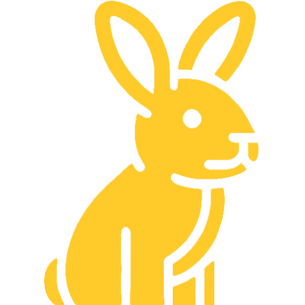
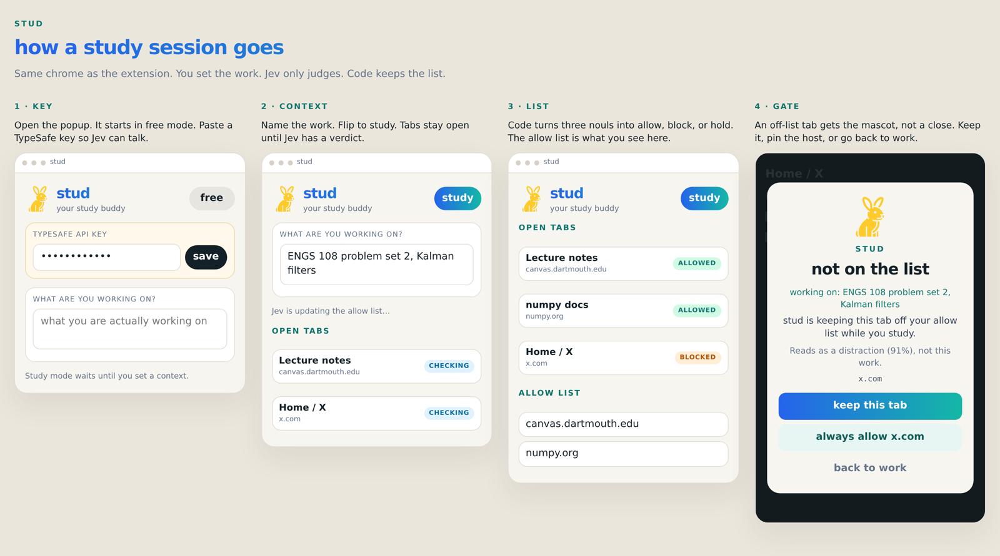
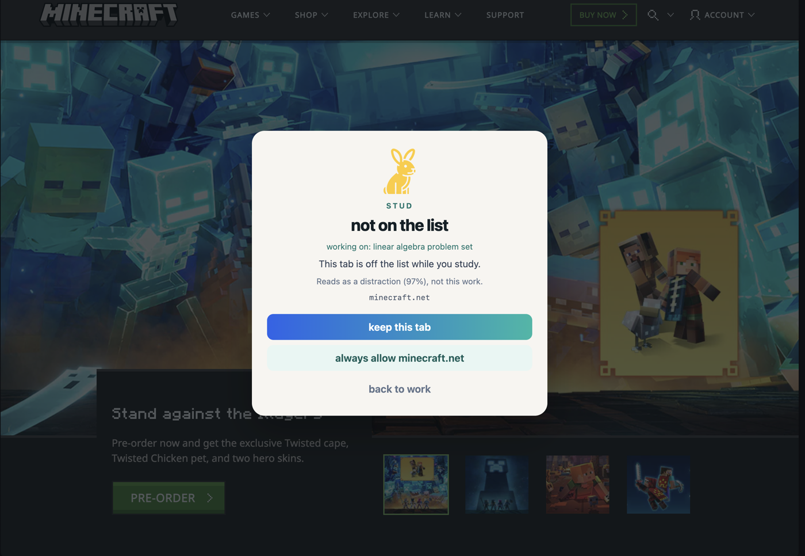
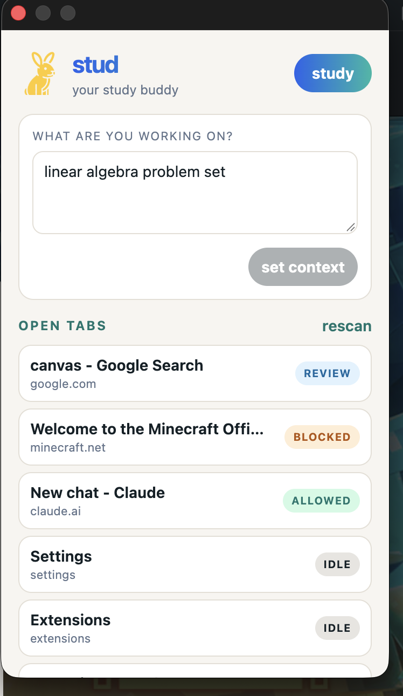

#  stud

Stud the study bud is a Chrome extension for the part of a study session that leaks into the browser. You are in problem sets and essays. Tabs pile up. Stud watches them against what you said you were working on.

Start a session, name the work, and keep going. Pages that belong stay. Pages that don't belong get a gate from the mascot. You can keep a tab, always allow a site, or go back to the work.

This build is the extension only. No timer, no break check-in, no past-session dashboard.

## Load

1. `npm install && npm run build`
2. Chrome → `chrome://extensions` → Developer mode → Load unpacked → `.output/chrome-mv3`
3. Paste a TypeSafe key, say what you are working on, press **Start session**

`npm run dev` for live reload on the same unpacked path.

## Decisions

One TypeSafe request per batch. Three yes/no scores per tab: does it help this work, is it a distraction, is it a general work tool. `lib/compose.ts` turns those into okay, off, or not sure.

Near 0.5 is not sure. A work tool can allow a whole host. A YouTube lecture is cached as that URL.

Pin sites in the popup. Thresholds live in `lib/defaults.ts`. The API key stays in `chrome.storage.local` on this device.

## Stack

Manifest V3, WXT, React, TypeScript. `POST https://api.typesafe.ai/v1/systemone` with `jev-latest`.
